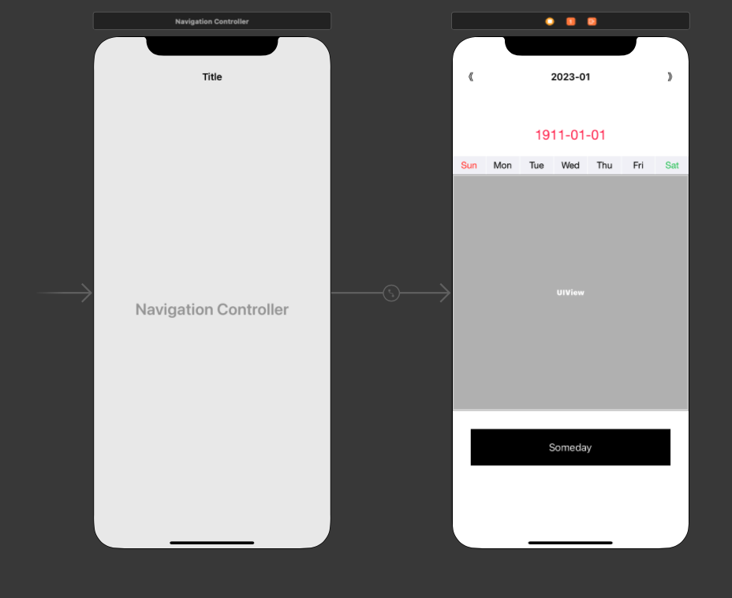

# WWPerpetualCalendar

[](https://developer.apple.com/swift/) [](https://developer.apple.com/swift/)  [](https://developer.apple.com/swift/) [](https://developer.apple.com/swift/)

## [Introduction - 簡介](https://swiftpackageindex.com/William-Weng)
- Use the functions of UIPageViewController to make a simple perpetual calendar.
- 利用UIPageViewController的功能，製作一個簡單的萬年月曆。

## [Achievements display - 成果展示](https://www.hkweb.com.hk/blog/ui設計基礎知識：引導頁對ui設計到底有什麼作用/)


## [Installation with Swift Package Manager - 安裝方式](https://medium.com/彼得潘的-swift-ios-app-開發問題解答集/使用-spm-安裝第三方套件-xcode-11-新功能-2c4ffcf85b4b)

```bash
dependencies: [
    .package(url: "https://github.com/William-Weng/WWPerpetualCalendar.git", .upToNextMajor(from: "1.1.0"))
]
```

## Usage - 使用方式
- Add Perpetual Calendar to ContainerView.
- 將WWPerpetualCalendar加入到ContainerView之中



## Function - 可用函式

|函式|功能|
|-|-|
|build(baseDate:perpetualCalendarDelegate:)|建立WWPerpetualCalendar|
|previousMonth(animated:completion:)|回上一個月|
|nextMonth(animated:completion:)|到下一個月|
|someMonth(selectDate:)|到某一個月|

## WWPerpetualCalendarDelegate

|函式|功能|
|-|-|
|calendarItemView(collectionView:dates:viewForItemAt:firstDayOfMonth:)|自訂的CellView|
|willChangeViewController(calendar:firstDayOfMonth:error:)|將要換到下一個月|
|didChangeViewController(calendar:firstDayOfMonth:error:)|已經換到下一個月|
|didSelectItem(collectionView:dates:at)|點選到該月的某一天|

## Example - 程式範例
```swift
import UIKit
import WWOnBoardingViewController
import WWPerpetualCalendar

final class ViewController: UIViewController {
    
    var perpetualCalendar: WWPerpetualCalendar!
    
    @IBOutlet weak var containerView: UIView!
    @IBOutlet weak var myLabel: UILabel!

    override func viewDidLoad() {
        super.viewDidLoad()
        initSetting()
    }
    
    @IBAction func previousMonth(_ sender: UIBarButtonItem) {
        perpetualCalendar.previousMonth(completion: nil)
    }
    
    @IBAction func nextMonth(_ sender: UIBarButtonItem) {
        perpetualCalendar.nextMonth(completion: nil)
    }
    
    @IBAction func someMonth(_ sender: UIButton) {
        guard let date = Date()._adding(component: .month, value: Int.random(in: 5...10)) else { return }
        self.perpetualCalendar.someMonth(selectDate: date)
    }
}

extension ViewController: WWPerpetualCalendarDelegate {
    
    func calendarItemView(collectionView: UICollectionView, dates: [Date], viewForItemAt indexPath: IndexPath, firstDayOfMonth: Date?) -> UIView {
        return cellViewMaker(collectionView: collectionView, dates: dates, viewForItemAt: indexPath, firstDayOfMonth: firstDayOfMonth)
    }
    
    func didSelectItem(collectionView: UICollectionView, dates: [Date], at indexPath: IndexPath) {
        didSelectItemAction(collectionView: collectionView, dates: dates, at: indexPath)
    }
    
    func willChangeViewController(calendar: WWPerpetualCalendar, firstDayOfMonth: Date?, error: WWOnBoardingViewController.OnBoardingError?) {
        willChangeViewControllerAction(calendar: calendar, firstDayOfMonth: firstDayOfMonth, error: error)
    }
    
    func didChangeViewController(calendar: WWPerpetualCalendar, firstDayOfMonth: Date?, error: WWOnBoardingViewController.OnBoardingError?) {
        didChangeViewControllerAction(calendar: calendar, firstDayOfMonth: firstDayOfMonth, error: error)
    }
}

private extension ViewController {
    
    func initSetting() {
        let perpetualCalendar = WWPerpetualCalendar.build(perpetualCalendarDelegate: self)!
        self.perpetualCalendar = perpetualCalendar
        self._addChild(on: containerView, to: perpetualCalendar)
    }
    
    func cellViewMaker(collectionView: UICollectionView, dates: [Date], viewForItemAt indexPath: IndexPath, firstDayOfMonth: Date?) -> UIView {
        
        guard let date = dates[safe: indexPath.row],
              let firstDayOfMonth = firstDayOfMonth
        else {
            fatalError()
        }
        
        let cellView = CellView()
        cellView.configure(date: date, firstDayOfMonth: firstDayOfMonth)
        
        return cellView
    }
    
    func didSelectItemAction(collectionView: UICollectionView, dates: [Date], at indexPath: IndexPath) {
        
        guard let selectedDate = dates[safe: indexPath.row] else { return }
                
        collectionView.visibleCells.forEach { cell in
            
            guard let cell = cell as? WWCalendarCollectionViewCell,
                  let cellView = cell.subviews.last as? CellView
            else {
                return
            }
            
            cellView.selectedView.isHidden = (cell.indexPath != indexPath) ? true : false
        }
        
        myLabel.text = selectedDate._localTime(with: .short)
    }
    
    func willChangeViewControllerAction(calendar: WWPerpetualCalendar, firstDayOfMonth: Date?, error: WWOnBoardingViewController.OnBoardingError?) {
        
        if let error = error { myLabel.text = "\(error)"; return }
        myLabel.text = title
    }
    
    func didChangeViewControllerAction(calendar: WWPerpetualCalendar, firstDayOfMonth: Date?, error: WWOnBoardingViewController.OnBoardingError?) {
        
        if let error = error { myLabel.text = "\(error)"; return }
        
        title = firstDayOfMonth?._localTime(with: .yearMonth)
        myLabel._fadeEffect(0.5)
        myLabel.text = title
    }
}
```

